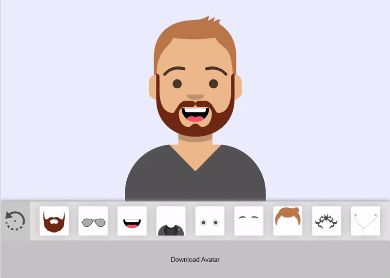

# Avatar Maker

Collect your avatar from different parts. The code of this program is very easy, any developer will be able to understand the code. SVG is used to draw an avatar.

## Demo

[Demo version of the project](https://avatarx.netlify.app/)

## Preview



## Mobile app

Link to the Avatar Maker mobile app for Android on Google Play: [Mobile app](https://play.google.com/store/apps/details?id=com.favrora.avatar)

## Development

Getting Start:
* Open a terminal. 
* Go to the folder where you want to copy the project. 
* Copy the project with this command:

    ```sh
    $ git clone https://github.com/favrora/Avatar-Maker.git
    ```

* Go to the project folder:

    ```sh
    $ cd avatar-maker
    ```

In order to run it locally you'll need to fetch some dependencies and a basic server setup.

* Install local dependencies:

    ```sh
    $ npm install
    ```

* Start the development server and open [`http://localhost:8080`](http://localhost:8080).

    ```sh
    $ npm run serve
    ```
    
* To build production bundle use:

   ```sh
   $ npm run build
   ```

## Open tasks

* [Align the avatar to the bottom for mobile devices.](https://github.com/favrora/Avatar-Maker/issues/9)
* [Add the ability to change color](https://github.com/favrora/Avatar-Maker/issues/14)
* [Add a female avatar](https://github.com/favrora/Avatar-Maker/issues/15)
* [Configure the avatar download function](https://github.com/favrora/Avatar-Maker/issues/16)

## Completed tasks

* ~~Change random avatar without reloading the site.~~ | Done by [Bruno Neves](https://github.com/7br-uno) | 23.03.2021
* ~~Add function to download created avatar as a png image.~~ | Done by [Peter H.](https://github.com/PetFeld) | 01.03.2021
* ~~Create a demo site~~ | Done by [Andrew Kliskey](https://github.com/andrewkliskey) | 03.02.2021

## Test

<div style="displat: flex">
 <a href="https://www.producthunt.com/posts/avatar-maker-2?utm_source=badge-featured&utm_medium=badge&utm_souce=badge-avatar-maker-2" target="_blank"></a>

  <a href="https://www.producthunt.com/posts/avatar-maker-2?utm_source=badge-top-post-badge&utm_medium=badge&utm_souce=badge-avatar-maker-2" target="_blank"></a>
</div>
