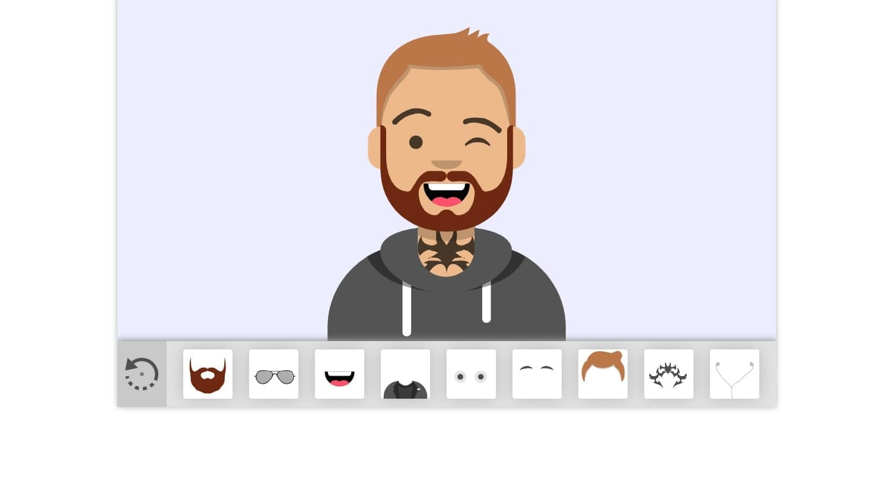

# Avatar Maker

Collect your avatar from different parts. The code of this program is very easy, any developer will be able to understand the code. SVG is used to draw an avatar.

## Demo

[Demo version of the project](https://avatar-maker-vue.netlify.app/)

## Preview



## Development

Getting Start:
* Open a terminal. 
* Go to the folder where you want to copy the project. 
* Copy the project with this command:

    ```sh
    $ git clone https://github.com/favrora/Avatar-Maker.git
    ```

* Go to the project folder:

    ```sh
    $ cd avatar-maker
    ```

In order to run it locally you'll need to fetch some dependencies and a basic server setup.

* Install local dependencies:

    ```sh
    $ npm install
    ```

* Start the development server and open [`http://localhost:8080`](http://localhost:8080).

    ```sh
    $ npm run serve
    ```
    
* To build production bundle use:

   ```sh
   $ npm run build
   ```

## Open tasks

* [Add function to download created avatar as a png image.](https://github.com/favrora/Avatar-Maker/issues/7)
* [Align the avatar to the bottom for mobile devices.](https://github.com/favrora/Avatar-Maker/issues/9)
* [Change random avatar without reloading the site](https://github.com/favrora/Avatar-Maker/issues/8)

## Completed tasks

* ~~Create a demo site.~~ | Done by [Andrew Kliskey](https://github.com/andrewkliskey)
